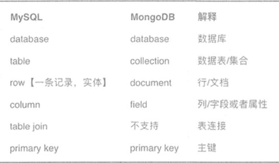

# W2

## 数据库概念

### 定义

数据库是按照数据结构来组织、存储和管理数据的“仓库”。

### 作用

1. 永久性存储
1. 查询效率高
1. 管理方便

### 种类

1. 关系型数据库

   MySQL, Oracle

2. 非关系型数据库

   Redis, MongoDB, Hbase,Elasticsearch



### 三大范式

1. 每一个列都不能再分
1. 非关键列完全依赖于整个主键
1. 非关键列只依赖于主键，而不依赖于其他非关键列

## MySQL

`net start | findstr MySQL`

### 什么是MySQL

MySQL是一个关系型数据库管理系统，由瑞典MySQL AB 公司开发，属于 Oracle 旗下产品。MySQL 是最流行的关系型数据库管理系统之一，在 WEB 应用方面，MySQL是最好的 RDBMS (Relational Database Management System，关系数据库管理系统) 应用软件之一。在Java企业级开发中非常常用，因为 MySQL 是开源免费的，并且方便扩展。

### MySQL vs SQL

SQL(Structured Query Language)是用于管理关系数据库管理系统的语言，可以用来访问和处理数据库，包括数据插入、查询、更新和删除。

### MySQL表结构

### 存储引擎

1. InnoDB

   所有操作都比较频繁，支持事务，保持数据完整性

2. MyIASM

   以查询、插入为主

3. MEMORY

### 有关权限的表

1. 

### 常用约束类型

- UNSIGNED
- ZEROFILL
- NOT NULL
- DEFAULT 
- PRIMARY KEY 主键约束：不为空且唯一
- AUTO_INCREMENT
- UNIQUE KEY 唯一值限制，比如身份证号每个人只有一个。
- FOREIGN KEY

### 数据类型

1. 整型

   - TINYINT 1字节 常用于布尔类型
   - INT 4字节 -21亿-21亿
   - BIGINT 8字节 $-10^{21} $~$ 10^{21}$

   `TINYINT [UNSIGNED]`

1. 浮点型

   - FLOAT $10^{38}$
   - DOUBLE $10^{308}$

1. 定点数

   - DECIMAL 

1. 日期

   - DATETIME
   - TIMESTAMP

   **_日期格式说明_**

1. 字符串

   - CHAR(M) 字符串长度不足M，用空格填充
   - VARCHAR(M) 存储占用字符串长度L+1个字节，当L<=M时
   - TEXT 默认$2^{16}$字节
   - BLOB 默认$2^{16}$字节

   微博可发布最长140字->最长2000字内容

1. 

### 键

1. 主键(primary key)

1. 外键(foreign key)

   | id   | class_id | name |
   | ---- | -------- | ---- |
   | 1    | 1        | 小明 |
   | 2    | 1        | 小红 |
   | 3    | 2        | 小黄 |

   | id   | classname |
   | ---- | --------- |
   | 1    | 一班      |
   | 2    | 二班      |

   ```sql
   ALTER TABLE students
   ADD CONSTRAINT fk_class_id
   FOREIGN KEY (class_id)
   REFERENCES classes (id);
   ```

   如果向students表中插入记录时的class_id在classes表中没有对应的id，则不允许插入

3. 超键(super key)

   能唯一标识一条记录的属性集合

   （学号，性别）；（学号，性别，年龄）；（身份证，性别）

4. 候选键(candidate key)

   没有冗余属性的超键

   （学号），（身份证）


### 增删改查

#### 创建数据库和表

1. 创建数据库

   `create database evatest;`

2. 选中数据库

   `use evatest;`

3. 在当前数据库下创建表

```sql
create table user
(
    id       int auto_increment primary key,
    name     varchar(20)                        null comment 'name',
    age      tinyint               default 0    null comment 'age',
    gender   enum ('secret', 'male', 'female') default 'secret' not null comment 'gender',
    weight 	 float 								null comment 'weight',
    height   float 								null comment 'height',
    birthday datetime                               null comment 'birthday',
    address  char(100)                        null comment 'address',
    phone    char(11)                        null comment 'phone number'
)ENGINE=InnoDB, charset=utf8 comment 'user info'; 
```

存储引擎，字符编码

_**实践：建个学生成绩表**_

#### 插入记录

`insert into user(name, age, gender, birthday, address, phone)  values ('Vinko Fun',21,'secret','2001-12-31','ZheJiang HangZhou','18888888888');`

`insert into user(name, age, gender, birthday)  values ('Luna',21,'secret','2002-01-01');`

#### 更新记录

`update user set phone='12345678901', gender='female', weight=50, height=165 where id=2;`

#### 查找记录

##### 查询所有数据

`select * from user;`

##### 查询指定列

`select name,age,birthday from user;`

##### 取别名

`select name as '名字', age as '年龄' from user`

##### 条件查询

插入些数据

```
insert into user(name, age, gender, height, weight)
VALUES ('yzq', 27, 'male', 173, 130);
insert into user(name, age, gender, height, weight)
VALUES ('YuZhiQiang', 27, 'male', 173, 130);
insert into user(name, age, gender, height, weight)
VALUES ('xeon', 20, 'secret', 180, 150);
insert into user(name, age, gender, height, weight)
VALUES ('xeon', 27, 'male', 168, 130);
insert into user(name, age, gender, height, weight)
VALUES ('ZhangSan', 19, 'male', 176, 140);
insert into user(name, age, gender, height, weight)
VALUES ('Wang Beautify', 18, 'female', 160, 100);
insert into user(name, age, gender, height, weight)
VALUES ('Li Pretty', 22, 'female', 158, 98);
insert into user(name, age, gender, height, weight)
VALUES ('Zhao Genuis', 12, 'male', 158, 80);
insert into user(name, age, gender, height, weight)
VALUES ('Qian ManyMany', 50, 'secret', 163, 120);
insert into user(name, age, gender, height, weight)
VALUES ('Sun Wukong', 100, 'secret', 158, 90);
```

###### 比较运算符

`select * from user where age>20;`

###### 逻辑运算符

`select * from user where age>20 and gender='female';`

###### 模糊查询

%: 表示一个或多个字符

_: 表示单个字符

查询name以Vinko开头的

`select * from user where name like 'Vinko%';`

###### 排序查询

默认升序

`select * from user order by age desc;`

###### 聚合查询

对列操作

聚合函数

- count 指定列的个数（null不计入数量）
- sum 指定列数值的和（非数值类型记为0）
- max 指定列的最大值
- min 指定列的最小值
- avg 指定列的平均值

`select max(weight) from user where age>20;`

获取最大体重的完整记录

`select * from user where weight=(select max(weight) from user);`

###### 分组查询

1. `select * from user group by gender;`

   按年龄分组后，返回每组的第一条数据

1. 配合聚合函数

   `select gender, count(*) from user group by gender;`

   每组有多少人

1. 实践

   创建user表

   返回60分以下，60-70， 80-90， 90-100的人数

1. 找出年龄在20-30间的人，再按性别分组，返回组人数大于2的

   `select gender, count(*) from user where age between 20 and 30 group by gender having count(*)>1;`

###### 限制返回条数

limit [offset,]length

`select * from user limit 2,5;`

###### 关联查询

创建表

```sql
create table r(
	A char(2),
	B char(2),
	C char(2)
) ENGINE=InnoDB, charset=utf8;
```

```sql
create table s(
	C char(2),
	D char(2)
) ENGINE=InnoDB, charset=utf8;
```


R表

| A    | B    | C    |
| ---- | ---- | ---- |
| a1   | b1   | c1   |
| a2   | b2   | c2   |
| a3   | b3   | c3   |

S表

| C    | D    |
| ---- | ---- |
| c1   | d1   |
| c2   | d2   |
| c4   | d3   |

插入数据

```sql
insert into r(A,B,C) values('a1', 'b1', 'c1');
insert into r(A,B,C) values('a2', 'b2', 'c2');
insert into r(A,B,C) values('a3', 'b3', 'c3');
```

```sql
insert into s(C,D) values('c1', 'd1');
insert into s(C,D) values('c2', 'd2');
insert into s(C,D) values('c4', 'd4');
```


1. 交叉连接

   `select r.*,s.* from r,s`

   | A    | B    | C    | C    | D    |
   | ---- | ---- | ---- | ---- | ---- |
   | a1   | b1   | c1   | c1   | d1   |
   | a2   | b2   | c2   | c1   | d1   |
   | a3   | b3   | c3   | c1   | d1   |
   | a1   | b1   | c1   | c2   | d2   |
   | a2   | b2   | c2   | c2   | d2   |
   | a3   | b3   | c3   | c2   | d2   |
   | a1   | b1   | c1   | c4   | d4   |
   | a2   | b2   | c2   | c4   | d4   |
   | a3   | b3   | c3   | c4   | d4   |

1. 内连接

   `select r.*,s.* from r inner join s on r.c=s.c;`

   | A    | B    | C    | C    | D    |
   | ---- | ---- | ---- | ---- | ---- |
   | a1   | b1   | c1   | c1   | d1   |
   | a2   | b2   | c2   | c2   | d2   |

1. 左外连接

   `select r.*,s.* from r left join s on r.c=s.c;`

   | A    | B    | C    | C    | D    |
   | ---- | ---- | ---- | ---- | ---- |
   | a1   | b1   | c1   | c1   | d1   |
   | a2   | b2   | c2   | c2   | d2   |
   | a3   | b3   | c3   |      |      |

1. 右外连接

   `select r.*,s.* from r right join s on r.c=s.c;`

   | A    | B    | C    | C    | D    |
   | ---- | ---- | ---- | ---- | ---- |
   | a1   | b1   | c1   | c1   | d1   |
   | a2   | b2   | c2   | c2   | d2   |
   |      |      |      | c4   | d3   |

1. 全表连接

   `select r.*,s.* from r full join s on r.c=s.c;`

   mysql不支持

   | A    | B    | C    | C    | D    |
   | ---- | ---- | ---- | ---- | ---- |
   | a1   | b1   | c1   | c1   | d1   |
   | a2   | b2   | c2   | c2   | d2   |
   | a3   | b3   | c3   |      |      |
   |      |      |      | c4   | d3   |

1. 联合查询

   创建表

   ```sql
   create table A(
   	name char(2),
   	value int
   )ENGINE=InnoDB, charset=utf8;
   ```
   
   ```sql
   create table B(
   	name char(2),
   	value int
   )ENGINE=InnoDB, charset=utf8;
   ```
   
   ```
   insert into A(name, value) values('a1', 1);
   insert into A(name, value) values('a2', 2);
   insert into A(name, value) values('a3', 3);
   insert into B(name, value) values('b1', 4);
   insert into B(name, value) values('b2', 5);
   ```
   
   
   
   `SELECT * FROM A UNION SELECT * FROM B;`
   
   将A B中的记录结果统一返回，默认去除重复的行

***Excel对数据的操作***

#### 删除

1. 删除记录

   `delete from user where gender='保密';`

1. 删除表

   `truncate table user;`

### 数据表关系

1. 一对多

1. 多对多

1. 一对一

   将不常用的列分离出去，提高查询性能

**删除百万级数据**：

1. 删除索引
1. 删除数据
1. 重新创建索引

### 索引

#### 优点

1. 对被排序的字段建立索引

1. join on涉及的字段建立索引

1. 索引覆盖：select时尽可能只写建立过索引的字段

   索引覆盖减少回表时间

   

#### 缺点

1. 增删改查需要动态更新索引文件，降低单次操作速度
1. 索引文件占物理空间

#### 索引类型

1. 主键索引

   唯一、不为空

1. 唯一索引

   唯一

   可以创建组合唯一索引

1. 普通索引

   没有唯一要求

1. 全文索引

   搜索引擎关键技术

#### 索引设计创建原则

1. 对where筛选列、join on列建立索引

1. 对记录数少的表不用建立索引

1. 短索引，对长字符串列建立索引，指定前缀长度，节省索引空间

   `select count(*)/count(distinct left(password, prefixLen)) from user;`

   当返回值接近1时，prefixLen长度比较合适

1. 不要过度建立不必要的索引，

1. 更新频繁的列不建立索引

1. 区分度小的列不适合建立索引，如性别只有男女，或重复值过多的列

1. 不要创建(a)索引后再创建(a,b)索引，可以将(a)索引扩展为(a,b)索引

1. 最左前缀匹配原则

	对user表建立(name, age)的组合索引
                            
	 ```sql
	select * from user where name='Vinko Fun' and age=21;#可以命中索引
	select * from user where name='Vinko Fun';#可以命中索引
	select * from user where age=21;#不能命中索引
	```

	对user表建立(a,b,c,d)组合索引

	索引最多到> <范围条件限制的索引

	`select * from a=1 and b=2 and c>2 and d=3`

	只用到了(a,b,c)索引

	修改组合索引为(a,b,d,c)

	则可以用到(a,b,c,d)索引


​	`select * from user where name='Vinko Fun' and age=21`可以命中索引

​	`select * from user where name='Vinko Fun'`可以命中索引

​	`select * from user where age=21`不能命中索引

​	对user表建立(a,b,c,d)组合索引

​	索引最多到> <范围条件限制的索引

​	`select * from a=1 and b=2 and c>2 and d=3`

​	只用到了(a,b,c)索引

​	修改组合索引为(a,b,d,c)

​	则可以用到(a,b,c,d)索引

​	搜索方式

- 全表
- 全索引表
- 索引二分查找

9. 组合索引中离散大的索引放在前面

   使用count()方法查看字段的差异值

#### 索引创建方法

1. 创建表时指定

```sql
CREATE TABLE user_index2 (
	id INT auto_increment PRIMARY KEY,
	first_name VARCHAR (16),
	last_name VARCHAR (16),
	id_card VARCHAR (18),
	information text,
	KEY name (first_name, last_name),
	FULLTEXT KEY (information),
	UNIQUE KEY (id_card)
);
```

2. 增加索引

   `ALTER TABLE table_name ADD INDEX index_name (column_list);`

#### 删除索引

删除普通索引、唯一索引、全文索引

`alter table user_index drop KEY name;`
