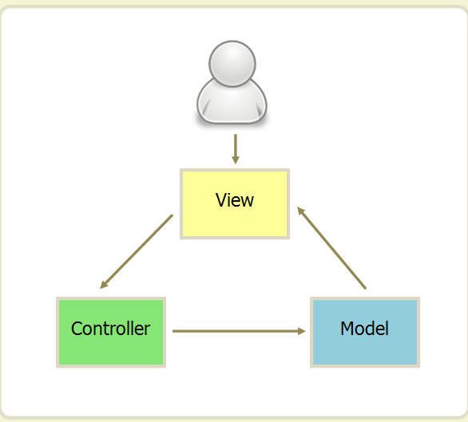
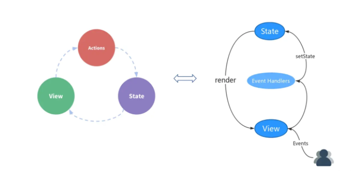

# W4

## 软件架构

如何设计一个软件或者程序的结构，这是一门专门的学问，叫做“软件架构”，属于编程的方法论。

### MVC

MVC是架构模式的一种。

#### 结构

1. Model（模型）

   管理数据的层，进行数据的增删改查

2. View（视图）

   呈现给用户操作的UI界面，管理组件的层，控制元素的挂载、删除、更新、插入。

3. Controller（控制）

   接收用视图层的指令

#### 各层间互动模式

##### 第一种

用户通过视图层向控制层发送命令，控制层改变数据层，数据层驱动视图层更新

##### 第二三四五六……种

#### 举例

1. 计算器
2. 

---

## 数据绑定与数据流

### 单向数据绑定 vs 双向数据绑定

**单向数据绑定**：Model的更新会触发View的更新，而View的更新不会触发Model的更新

**双向数据绑定**：Model的更新会触发View的更新，View的更新也会触发Modal的更新

React单向数据绑定模式

**单向数据绑定的优缺点**

**优点：**状态变化副作用少，所有状态变化都可以被记录、追踪，源头易追溯

**缺点：**会有很多类似的样板代码，代码量会上升

**单向数据绑定：**React

**单、双向数据绑定：**Vuew、Angular、AngularJS

### 单向数据流 vs 双向数据流

**单向数据流：**父组件通过props传递参数到子组件，子组件不能直接修改传递来的参数将修改后的参数传递回父组件

**双向数据流：**在子组件中可以直接更新父组件中的数据，而单向数据流中子组件改变父组件数据通过回调函数，最后实际上是在父组件中执行的函数改变的数据

双向数据流方便，但缺乏统一的规范和有效的管理，更容易出高难的bug

**单向数据流：**React, Vue 2.x, Angular

**双向数据流：**AngularJS、Vue 1.0

---

## React哲学

### 将设计好的UI按组件分级

一组完整的数据模型对应的一个组件

将大的数据模型拆分成小块，设计组件对应每个小块数据模型

### 编写静态版本

使用静态数据，先编写出不考虑与用户交互的静态版本

### 确定最小且完整的UI state

确定原则

1. 会随时间可能变化的数据
2. 所有确定的state数据是独立的，不能相互计算出
3. 如果是从父组件传递而来的，那不能作为state

### 确定state放置的位置

确定原则

1. 找出所有根据这个state渲染的组件，确定他们的共同上级组件，如果没有，则创建一个（可以称为容器）

### 添加反向数据流

由于React使用单向数据流

共同上级组件中的state作为props传递到子组件中，子组件更新上级组件需要上级组件传递回调函数

